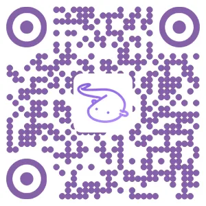

# 直播弹幕硬件交互平台

本项目旨在实现一个通过直播弹幕与线下的硬件系统进行实时交互的框架。

## 应用场景

一下列举了一些可能的应用场景。更多交互场景还需要经过实践挖掘。

### 机械装置

通过弹幕控制现场的机械臂，小车或其他机械装置进行动作。因为延迟的存在，体验类似于遥控月球车。

### GALGAME

通过弹幕投票控制如GALGAME的流程。实现自动化的能互动的云游戏。

### 棋类游戏

观众通过投票方式来进行多边的棋类对弈。

## 硬件架构

在树莓派上搭建了一个Nodejs应用用于从弹幕服务器获取弹幕推送，并将弹幕内容解析后，转换成控制指令通过websocket发送给`ESP8266`模组，经由`ESP8266`再去控制各种不同的硬件设备。

## 部署

直接搜索`SETUP:`能找到所有需要设置的地方。

在nodejs应用里，你需要设置开放的`websocket端口`和你的`直播房间号`。

在nodeMCU脚本里，你需要设置你的`wifi连接方式`和`ESP8266`模组连接到你的nodejs应用的`地址和端口`。

设置完成后直接运行即可。

## 赞助

